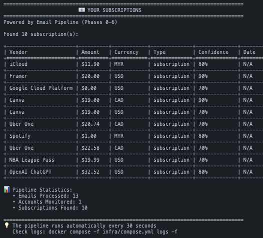

# EmailPipeLine

An event-driven email processing pipeline that automatically scans inboxes, normalizes emails, classifies subscriptions using AI, and persists data to PostgreSQL. Built with microservices architecture using Redis Streams for asynchronous message processing.

## 🏗️ Architecture

This application uses a **microservices architecture** with **event-driven communication**:

- **Phase 0-2**: Infrastructure (Redis, PostgreSQL, Docker Compose)
- **Phase 3**: IMAP Poller - Scans email inboxes and publishes raw emails
- **Phase 4**: Normalizer - Parses MIME, cleans text, computes body hash
- **Phase 5**: Classifier - Uses Claude AI to identify subscriptions and extract details
- **Phase 6**: Persister - Saves processed data to PostgreSQL database

Services communicate via **Redis Streams** with consumer groups for scalability and reliability.

## ✨ Features

- **Multi-Email Support**: Connect multiple email accounts via IMAP
- **AI-Powered Classification**: Claude AI identifies subscription services, amounts, and billing cycles
- **Idempotent Processing**: Prevents duplicate processing using SHA256 hashes
- **Scalable**: Horizontal scaling with Redis Streams consumer groups
- **Reliable**: Message acknowledgment and error handling
- **Clean Data**: HTML stripping, tracker removal, and content normalization

## 📋 Prerequisites

- Docker & Docker Compose
- Gmail account with App Password (or any IMAP email)
- Claude API key from [Anthropic Console](https://console.anthropic.com/)

## 🚀 Quick Start

### 1. Clone the Repository

```bash
git clone https://github.com/low122/EmailPipeLine.git
cd EmailPipeLine
```

### 2. Configure Environment

Create a `.env` file in the project root:

```env
# Email Configuration (IMAP)
IMAP_SERVER=imap.gmail.com
EMAIL_USER=your-email@gmail.com
EMAIL_PASSWORD=your-app-password

# Claude AI
CLAUDE_API_KEY=your-claude-api-key

# Redis (defaults work for Docker)
REDIS_HOST=redis
REDIS_PORT=6379

# PostgreSQL (defaults work for Docker)
DB_HOST=postgres
DB_PORT=5433
DB_NAME=email_pipeline
DB_USER=pipeline_user
DB_PASSWORD=pipeline_pass
```

### 3. Start Services

```bash
docker compose -f infra/compose.yml up -d
```

This starts:
- Redis (message queue)
- PostgreSQL (database)
- IMAP Poller (email scanning)
- Normalizer (email processing)
- Classifier (AI classification)
- Persister (database saving)

### 4. View Results

Query subscriptions from the database:

```bash
python show_subscriptions.py
```



Or connect directly:

```bash
docker exec -it postgres psql -U pipeline_user -d email_pipeline -c "SELECT * FROM classifications;"
```

## 📁 Project Structure

```
.
├── infra/
│   ├── compose.yml          # Docker Compose configuration
│   ├── init-scripts/         # Database initialization
│   └── init-db.sh            # Database setup script
├── services/
│   └── imap_poller/          # Phase 3: Email polling service
├── workers/
│   ├── normalizer/           # Phase 4: Email normalization
│   ├── classifier/           # Phase 5: AI classification
│   └── persister/            # Phase 6: Database persistence
├── show_subscriptions.py     # CLI tool to view results
└── README.md

```

## 🔄 How It Works

### Phase 3: IMAP Poller
- Connects to email server via IMAP
- Polls inbox every 30 seconds
- Fetches latest 100 emails
- Publishes raw emails to `raw_emails.v1` Redis Stream

### Phase 4: Normalizer
- Consumes from `raw_emails.v1`
- Parses MIME format
- Converts HTML to text
- Strips tracking pixels and UTM parameters
- Computes body hash for deduplication
- Publishes to `emails.normalized.v1`

### Phase 5: Classifier
- Consumes from `emails.normalized.v1`
- Sends email content to Claude AI
- Extracts: vendor, amount, currency, class, confidence
- Publishes to `emails.classified.v1`

### Phase 6: Persister
- Consumes from `emails.classified.v1`
- Saves to `messages` table (idempotent)
- Saves to `classifications` table
- Uses `ON CONFLICT DO UPDATE` for updates

## 📊 Database Schema

### Messages Table
- `id`: Primary key
- `idemp_key`: SHA256 hash for deduplication
- `mailbox_id`: Email address
- `external_id`: Email message ID
- `subject`: Email subject
- `body_hash`: Content hash
- `received_at`: Timestamp

### Classifications Table
- `message_id`: Foreign key to messages
- `vendor`: Service name
- `amount_cents`: Amount in cents
- `currency`: Currency code (USD, CAD, etc.)
- `class`: Type (subscription, one-time, etc.)
- `confidence`: AI confidence score (0.0-1.0)

## 🛠️ Development

### View Logs

```bash
# All services
docker compose -f infra/compose.yml logs -f

# Specific service
docker compose -f infra/compose.yml logs -f imap_poller
docker compose -f infra/compose.yml logs -f classifier
```

### Restart Services

```bash
docker compose -f infra/compose.yml restart imap_poller
```

### Rebuild After Code Changes

```bash
docker compose -f infra/compose.yml build --no-cache <service-name>
docker compose -f infra/compose.yml up -d <service-name>
```

## 🔒 Security

- **No Secrets in Code**: All credentials via environment variables
- **Idempotency**: Prevents duplicate processing
- **Local Processing**: All data processed locally
- **No Email Storage**: Only metadata and classifications stored

## 📝 Notes

- The pipeline polls every 30 seconds by default
- Processes latest 100 emails per poll
- Claude API is called for each normalized email
- Database uses PostgreSQL with idempotency keys

## 🐛 Troubleshooting

**Email not connecting:**
- Verify IMAP credentials in `.env`
- Check Gmail App Password is correct
- Ensure 2FA is enabled on Gmail

**No subscriptions found:**
- Check classifier logs: `docker compose -f infra/compose.yml logs classifier`
- Verify Claude API key is set
- Check if emails are being normalized: `docker compose -f infra/compose.yml logs normalizer`

**Database connection issues:**
- Ensure PostgreSQL is running: `docker compose -f infra/compose.yml ps postgres`
- Check database credentials in `.env`